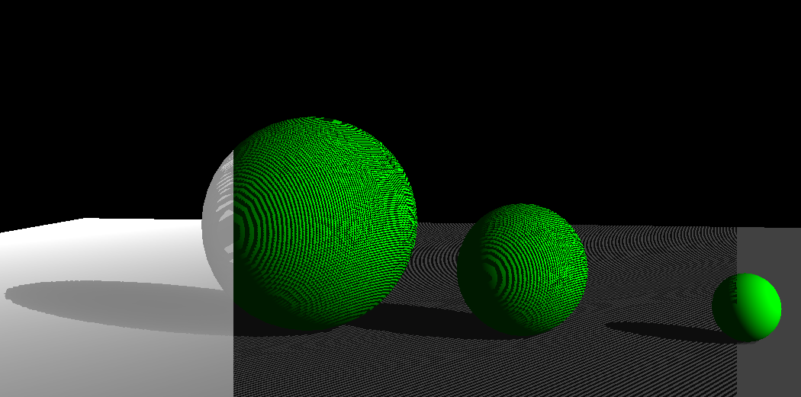

# Shadow Mapping - OpenGL

Computer Graphics project implementing real-time shadows using **Shadow Mapping**.

## Technologies

- **OpenGL 3.3** (Core Profile)
- **GLFW** - Window management
- **GLAD** - OpenGL loader
- **GLM** - Math library

## Algorithm

The project implements the **Shadow Mapping** technique in two passes:

1. **Shadow Pass**: Renders the scene from the light's perspective, saving only the depth values into a depth texture (FBO).
2. **Main Pass**: Renders the scene from the camera's perspective, comparing each fragment with the depth map to determine if it is in shadow.

### Implemented Techniques

| Screen Section | Technique |
|----------------|-----------|
| Left           | Depth Map visualization |
| Center         | Shadow without bias (evident shadow acne) |
| Right          | Shadow with **dynamic bias + PCF** (shadow anti-aliasing) |

## Controls

| Key | Action |
|-----|--------|
| W/A/S/D | Camera movement |
| Mouse | View rotation |
| Scroll | Zoom |
| ESC | Close |

## Structure
├── Shadow Mapping.cpp    # Entry point
├── ShadowMap.* # FBO and light matrix management
├── Shader.* # Shader compilation
├── Camera.* # FPS Camera
├── Sphere.* # Procedural sphere generation
├── Plane.* # Floor plane
├── Texture.* # Texture loading (stb_image)
└── shaders/
├── shadow.* # Shaders for shadow pass
└── basic.* # Main shader with Blinn-Phong

## Build

Requires Visual Studio 2022 with the C++ workload. Dependencies are already included in `Dependencies/`.

## Screenshot & Documentation

The scene shows 3 spheres of different sizes on a plane, with a marble texture applied to the rotating central sphere.

📄 **Project Report:** You can read the full project documentation here: [Relation.pdf](Relation.pdf)
